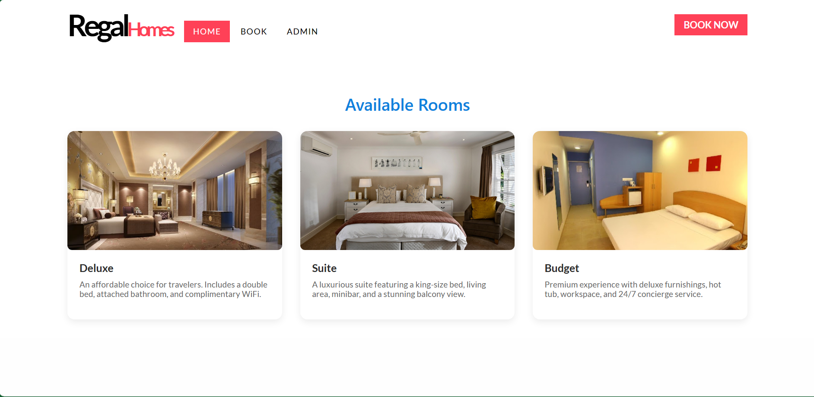
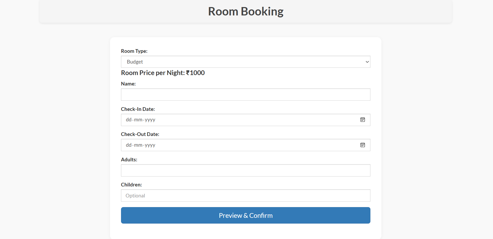

# 🏨 Hotel Reservation System using Flask

A responsive and feature-rich hotel booking web application developed using **Flask**. 
This system allows users to seamlessly book rooms, while administrators can manage bookings, rooms, and guests through a secure dashboard.

---

## ✨ Features

- 🔐 **Secure Authentication**: Login/Logout system for admins
- 🧾 **Room Booking**: Dynamic form with real-time price calculation
- 🧮 **JS-Powered UI**: Modal preview and date-based total price updates
- 🛎️ **Admin Dashboard**: View guest details and perform full CRUD operations
- 📊 **Room Availability Logic**: Prevents double bookings with live room checks
- 🎨 **Fully Responsive Design**: Built using Bootstrap and custom CSS

---

---

---

## 🧰 Tech Stack

| Technology | Description |
|------------|-------------|
| 🐍 Python | Backend logic |
| 🌐 Flask | Web framework |
| 🐬 MySQL | Relational Database |
| 🎨 HTML5, CSS3 | Frontend UI |
| ⚙️ JavaScript | Dynamic interactions |
| 🧾 Jinja2 | Templating engine |
| 📦 Bootstrap 3 | Responsive design |

---

